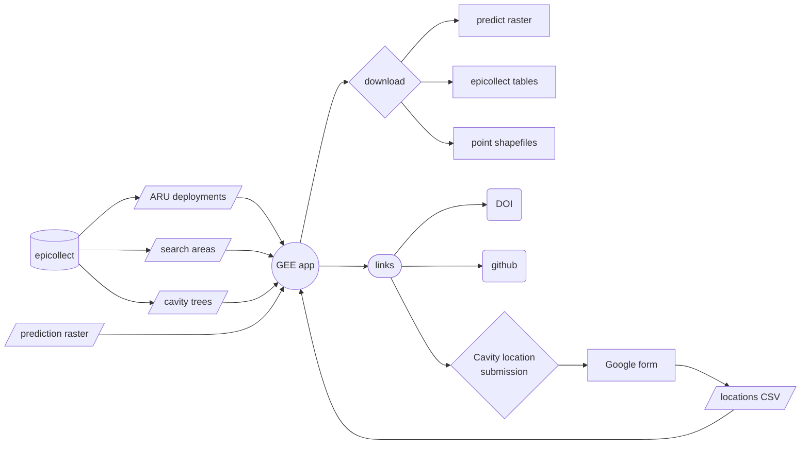

Using LiDAR to improve Pileated Woodpecker models

Methods, code, and workflow.

# Google Earth Engine App

```mermaid
flowchart LR

    app(("GEE app"))
    c1[/ARU deployments/]
    c2[/search areas/]
    c3[/cavity trees/]
    c4[/prediction raster/]
    download{download}
    o1[predict raster]
    o2[epicollect tables]
    o3[point shapefiles]
    links([links])
    l1(DOI)
    l2(github)
    l3{"Cavity location 
    submission"}
    l4[Google form]
    s1[/locations CSV/]
    epi[(epicollect)]
    
    


	epi-->c1
	epi-->c2
	epi-->c3
	
	c1-->app
	c2-->app
	c3-->app
	c4--->app
	app-->download
	download-->o1
	download-->o2
	download-->o3
	app-->links
	links-->l1
	links-->l2
	links-->l3
	l3-->l4
	l4-->s1
	s1----->app
```

