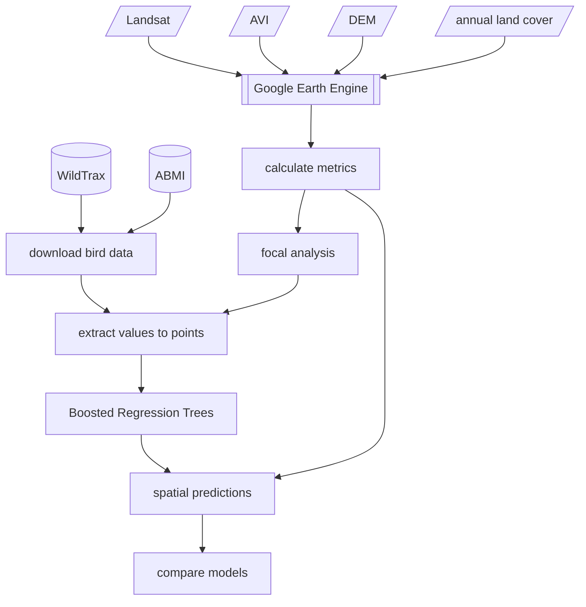

# Pileated Woodpecker Nest Detection
**Dr. Brendan Casey, Dr. Erin Bayne**

The Migratory Bird Convention (MBCA) act is a law intended to limit the accidental destruction of nests from human activities. Recent amendments for Pileated Woodpecker cavity nests stipulate that nests must be protected year-round and those not being used must be protected for 36 months from last known use before removal is allowed. For industry to operate efficiently and not violate these regulations requires an understanding of where Pileated Woodpecker are located to ensure they are in compliance. This project provides a set of tools for helping industry identify where Pileated Woodpecker are likely to be and where additional monitoring is and is not needed to find nests.

A [web application](https://ee-bgcasey-piwomodels.projects.earthengine.app/view/pileatedwoodpecker) presents our latest predictive map, areas that we have searched for Pileated Woodpecker nest cavities, and known nest cavity locations can be found 

Here is a graphical overview of our methodological workflow:

Descriptions of code and methods can be found through the links below. 

1. [Sourcing and processing Pileated Woodpecker data]("documentation/piwo_data.md")
   - [process_bird_data.R]("1_code/r_scripts/1_process_bird_data.R")
   - [qpad_offsets.R]("1_code/r_scripts/2_qpad_offsets.R")
2. [Extracting spatial covariates]("documentation/spatial_covariates.md")
   - [extract_spatial_data.js]("1_code/GEE/extract_spatial_data.js")
   - [summarize_covariates.R]("1_code/r_scripts/3_summarize_covariates.R")
3. [Statistical analyses]("documentation/statistical_analyses.md")
   - [boosted_regression_trees.R]("1_code/r_scripts/4_boosted_regression_trees.R")
   - [spatial_predictions.R]("1_code/r_scripts/5_spatial_predictions.R")
   - [summarize_results.R]("1_code/r_scripts/6_summarize_results.R")
4. [Model validation and random stratified sampling]("documentation/random_stratified_sampling.md")
   - [random_stratified_sampling.R]("1_code/r_scripts/7_random_stratified_sampling.R")
5. [Building a web application using Google Earth Engine]("documentation/gee_web_application.md")
   - [get_epicollect_data.R]("1_code/r_scripts/get_epicollect_data.R")
   - [piwo_webapp.js]("1_code/GEE/piwo_webapp.js")

Please direct all correspondence to Dr. Brendan Casey (bgcasey@ualberta.ca)
